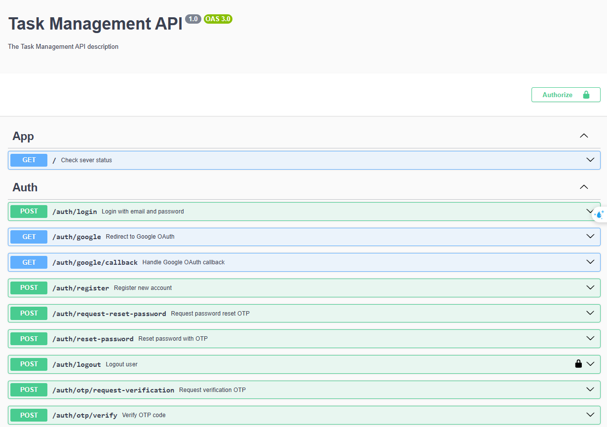

# Task Management Backend

Backend API for task management system built with NestJS.

> ⚠️ **Development Status**: This project is currently under active development. Some features may be incomplete or subject to change. I'm working on improving stability and adding new features.

## Features

- User authentication (JWT, Google OAuth)
- Task management (CRUD operations)
- Project organization
- Push notifications
- Task filtering and status tracking
- API Documentation with Swagger

## Tech Stack

- NestJS
- PostgreSQL
- JWT & Google OAuth2
- Firebase Cloud Messaging
- Swagger/OpenAPI

## Getting Started

### Prerequisites

- Node.js (v18+)
- PostgreSQL
- Firebase project (for notifications)

### Installation

1. Clone the repository:
   ```bash
   git clone https://github.com/yourusername/task-management-backend.git
   cd task-management-backend
   ```

2. Install dependencies:
   ```bash
   npm install
   ```

3. Configure environment variables:
   ```bash
   cp .env.example .env
   ```
   Update the values in `.env` file.

4. Start the server:
   ```bash
   npm run start:dev
   ```

### Docker

```bash
# Build
docker build -t task-management-backend .

# Run
docker run -p 8080:8080 task-management-backend
```

## API Documentation

The API documentation is available through Swagger UI. After starting the server, you can access it at:

```
http://localhost:8080/api-docs
```

The Swagger UI provides:
- Interactive API documentation
- Request/response examples
- Authentication requirements
- API endpoints testing interface
- Schema definitions
- Response models

Below are some screenshots of the API documentation interface:




## Environment Variables

```env
# App
PORT=8080
NODE_ENV=development

# Database
DB_HOST=localhost
DB_PORT=5432
DB_USERNAME=postgres
DB_PASSWORD=your_password
DB_NAME=task_management

# JWT
JWT_SECRET=your_jwt_secret
JWT_EXPIRATION=1d

# Google OAuth
GOOGLE_CLIENT_ID=your_client_id
GOOGLE_CLIENT_SECRET=your_client_secret
GOOGLE_CALLBACK_URL=http://localhost:8080/auth/google/callback
```

## Project Structure

```
src/
├── modules/
│   ├── auth/           # Authentication
│   ├── users/          # User management
│   ├── tasks/          # Task management
│   ├── projects/       # Project management
│   └── notification/   # Notifications
├── shared/            # Shared utilities and middleware
│   ├── swagger/       # Swagger configuration and decorators
│   └── utils/         # Common utilities
└── main.ts           # App entry point
```

## Upcoming Features
- [ ] Admin Management
- [ ] Validate account by Email
- [ ] Docker Compose
- [ ] Rate limiting
- [ ] Caching

## Contributing

1. Fork the repository
2. Create your feature branch (`git checkout -b feature/amazing-feature`)
3. Commit your changes (`git commit -m 'Add some amazing feature'`)
4. Push to the branch (`git push origin feature/amazing-feature`)
5. Open a Pull Request

